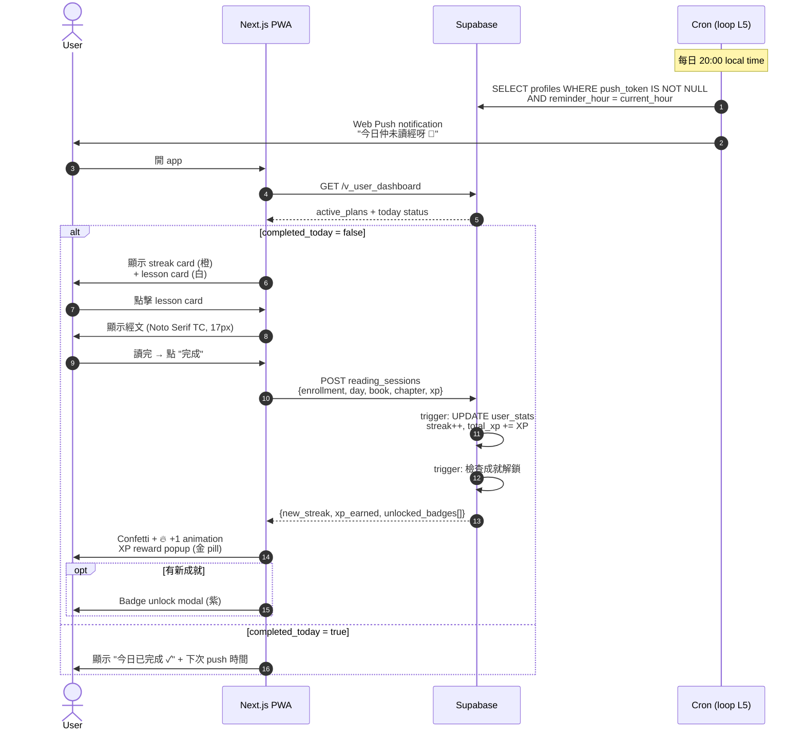
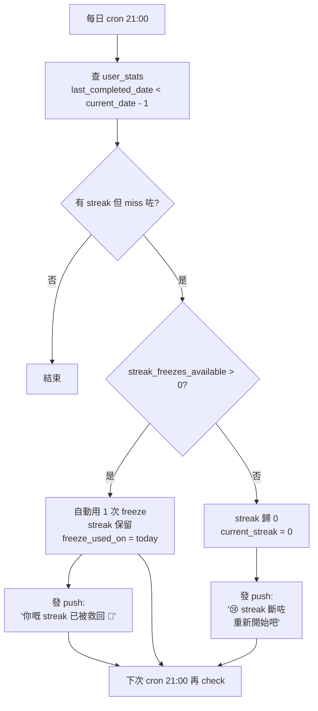
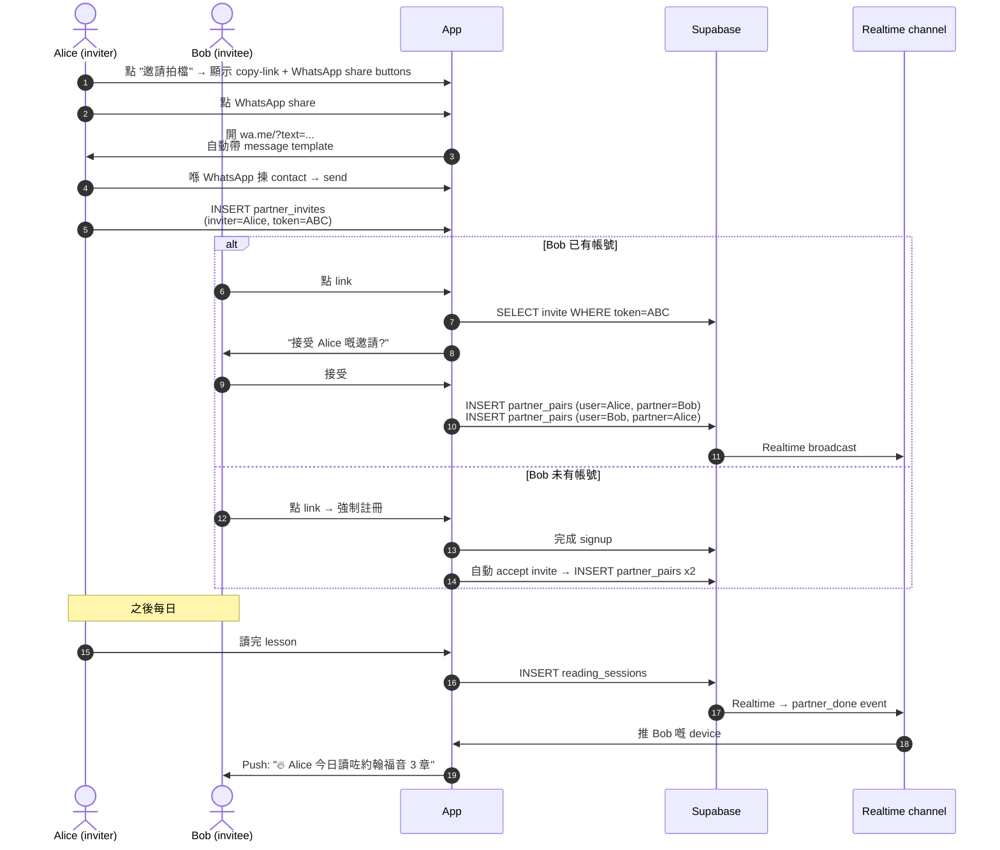

# Bible Quest — User Journey Flows

> 4 個關鍵 flow。Mermaid syntax，可以直接 paste 入 GitHub markdown。

---

## Flow 1: First-time Onboarding

```mermaid
flowchart TD
    A[下載 PWA / 訪問網站] --> B{已有帳號?}
    B -- 否 --> C[Sign up: Email / Google OAuth]
    B -- 是 --> D[Sign in]
    C --> E[auth.users trigger<br/>自動建 profile + user_stats]
    D --> F[Dashboard 檢查 onboarding_done]
    E --> F
    F -->|false| G[Plan Builder — single page live preview]
    G --> G1{揀範圍}
    G1 -- 新約 only --> G2
    G1 -- 舊約 only --> G2
    G1 -- 新約 + 舊約 --> G1a[揀 reading order<br/>先新後舊 / 先舊後新 / 新舊並行]
    G1a --> G2
    G2[拖 slider 40-365 日] --> G3[即時 preview:<br/>每日 X NT + Y OT 章<br/>預計完成日]
    G3 --> H[確認 → INSERT user_plan_enrollments<br/>(scope, reading_order, total_days, chapters_per_day)]
    H --> K{想唔想即刻邀請 partner?}
    K -- 是 --> L[輸入 partner email]
    K -- 唔住 --> N[Dashboard]
    L --> M[INSERT partner_invites<br/>發 email link]
    M --> N[Dashboard]
    N --> O[設定 push notification 時間]
    O --> P[UPDATE profiles.onboarding_done = true]
    P --> Q[首頁：今日 lesson card]
```

**Key state transitions**
- `auth.users.created` → `profiles.created` + `user_stats.created` (via trigger)
- 1st `user_plan_enrollments` row created at end of plan picker
- `onboarding_done = true` only after push time set

---

## Flow 2: Daily Lesson (happy path)



**Critical**: `reading_sessions.date_local` 必須係 user local date（用 profile.timezone），唔可以用 server `current_date`。Supabase 唔會幫你做 timezone conversion，要 app layer 處理。

---

## Flow 3: Streak Break + Freeze



**State machine**:
- `current_streak` only changes on `reading_sessions INSERT` or freeze trigger
- `last_completed_date` is single source of truth for "did you complete today"
- Freeze replenishes monthly via cron (function `replenish_streak_freezes`)

---

## Flow 4: Accountability Partner (1-on-1)



**Privacy rule**: Partner can ONLY see via `v_partner_progress` view:
- ✅ display name, avatar, current_streak, longest_streak, completed_today, total_xp, level
- ❌ NOT which book/chapter they read
- ❌ NOT reflection notes (no reflection in MVP anyway)
- ❌ NOT time of day they read

---

## State Diagram: User Stats (核心 state machine)

```mermaid
stateDiagram-v2
    [*] --> New: signup
    New --> Active: 第一次 reading_session
    Active --> Active: daily reading_sessions<br/>(streak++)
    Active --> AtRisk: miss 1 day,<br/>freeze available
    AtRisk --> Active: use freeze<br/>(streak preserved)
    AtRisk --> Broken: freeze used OR<br/>miss 2 days
    Broken --> Active: restart reading<br/>(streak=1)
    Active --> LongTerm: streak ≥ 100<br/>+ achievement unlock
    LongTerm --> LongTerm: keep going
    note right of AtRisk: 21:00 cron 檢查
    note right of Broken: Push: 重新開始吧
```

---

## Critical User Flows Not Yet Drawn (待 spec 確認後再畫)

- **Push notification unsubscribe** — 用戶改變主意唔想收 push
- **Plan switch** — 用戶中途由 NT-40 轉去自訂 plan
- **Account deletion** — GDPR / 私隱 compliance
- **Achievement share** — 解鎖後分享到 IG / WhatsApp (Stage 2+)

要我畫以上任何一個 flow 即管講。